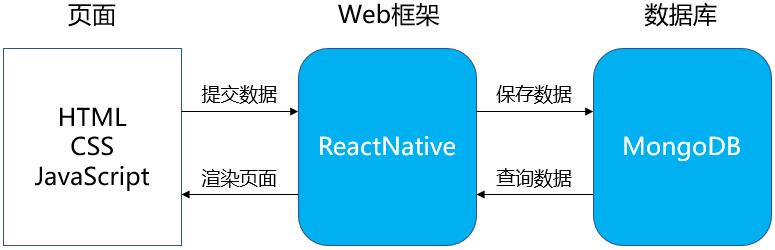

# About

## 1、项目简介
TaskCat是大学生通过做任务挣钱的云平台，它属于以运营为中心的服务软件，也可以理解为面向大学生的专业“众包”平台。其系统构成很简单，由一个React Native框架搭建的网站及MongoDB数据库构成。其基本业务是：用户在平台上发布任务和接收任务。发布任务需要消耗一定的代币，而接收任务可以为用户赚取代币。代币可以通过充值获得，也可以进行提现。

## 2、项目结构

## 3、Iterations 迭代
**Iterations 1:**
- 时间:3月17日-5月19日
- 内容:
  - 文档部分：
    - 完成分工；
    - 完成About、Team profile、Vision、Product Backlog；
    - 完成Requirement specification；
  - 实现部分:
    - 完成产品原型构造；
    - 实现登录、注册功能；

**Iterations 2:**
- 时间:5月20日-6月15日
- 内容:
  - 文档部分：
    - 数据库设计、接口API设计、架构设计、用例设计；
    - 生产规范与指南；
  - 实现部分：
    - 实现任务发布功能；
    - 实现任务查找功能；
    - 实现报名功能；
    - 实现已发布/已报名任务查看功能；
    - 实现任务管理功能；
    - 实现任务评价功能；

**Iterations 3:**
- 时间:6月9日-6月22日
- 内容:
    - 文档部分:
      - 界面设计文档；
      - 补充、完善文档；
    - 实现部分：
      - 优化UI设计；
      - 修改适配IOS版本；
      - 其他拓展功能；
