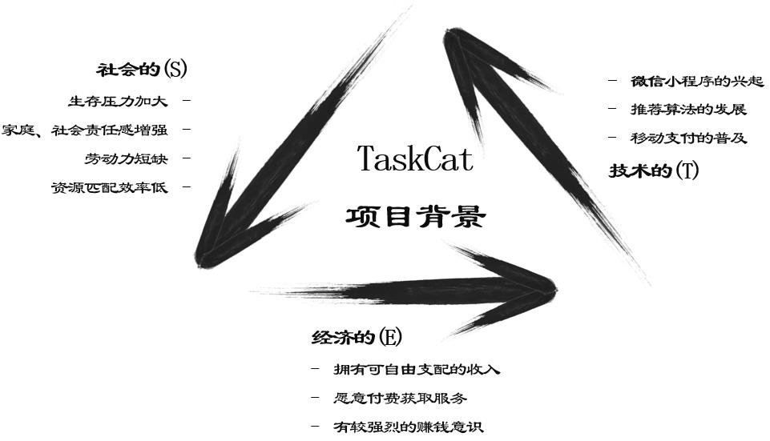
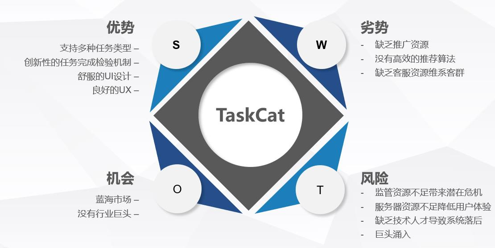

# 项目愿景

## 一句话的项目概述
TaskCat致力于运用现代互联网技术为当代大学生打造一个任务众包平台。我们的目标是：通过平台的功能和算法的优势，高效地连接任务的供需方并促成合作。我们的愿景是：有发布任务需求的学生/组织可以借助本平台快速地实现自己的目的；有闲暇时间的学生可以通过本平台将时间转换为实际的经济收益。

## 项目背景
为清晰地展示本项目的背景，我们拟使用SET模型，从社会Sociocultural、经济Economic和技术Technological三个维度来分析，结果如下：

## 最具价值的业务场景故事
大学生正值“象牙塔”和“社会”的过渡期，在从家庭温暖的港湾逐渐出航到波涛汹涌的大海的过程中，他们会逐渐产生独立意识，并热衷于寻求实现财务自由的途径。然而如今各所大学都在积极推动学术水平的提高，大学生的课业也较为繁忙，使得学生不具备通过兼职赚钱的条件。另一方面，当代大学生在参加竞赛或科研的过程中，又需要收集大量的数据样本，而仅仅通过群发消息的方式搜集样本的效率又较低，阻碍了他们研究的步伐。

在这样的背景下，学生们迫切需要一个媒介，可以让一部分学生利用闲暇时间赚取生活费，又可以让一部分的学生快速地开展调研、收集数据。而我们的平台，正是这样的媒介。在这里，学生可以根据自己的需求发布任务(问卷调查、跑腿、技术帮助等)，并快速获得其他学生的响应，以合理的经济成本达到目标、节约时间。在这里，学生也可以参与别人发布的任务，利用闲暇时间完成自己力所能及的工作，换取可观的受益。为了促进合作的达成，我们会通过匹配算法向学生们精准地推荐适合自身的任务，在帮助学生发掘更多任务机会的同时，也加速了发布者的任务完成效率，为整个任务生态的发展奠定坚实的基础。

不仅如此，在平台发展的过程中，我们还会引入外部的优质商家和组织，允许他们以企业身份发布任务，以完善任务生态与增加任务多样性、提高总体报酬水平，实现学生与商家间的合作共赢。

## 项目的基本特征
- 项目打造的是一个开放的众包平台，不仅允许用户接收任务赚钱，也允许用户发布任务；
- 平台创新性地使用“完成码”验证机制，可以很好地适配任务发布者不同的任务类型，也减轻发布者对参与者任务完成的检验工作；
- 项目打造的平台基于微信小程序，用户可以即时使用而不用安装，提升使用的便捷度；

## 简短的竞争或趋势分析，如 SWOT分析模型，盈亏平衡点模型等

