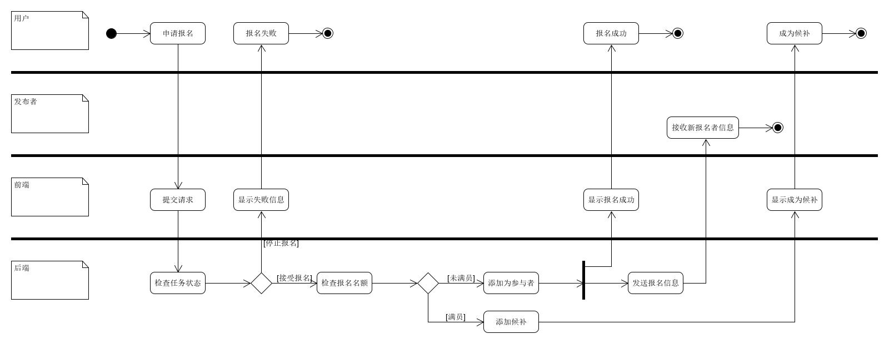

# 用例
**用例名称：** 发布与参与任务

**范围：** “赚快钱”众包平台

**级别：** 用户目标

**主要参与者：** 任务发布者与参与者

**涉众及其关注点：**
  - 任务发布者：希望能够发布任务，并能借助金钱的激励使需求得到快速响应，以快速地让需求得到满足。
  - 任务参与者：希望能利用闲暇时间，完成一些力所能及的工作，以获得满意的报酬。
  - 平台：希望能够借助良好的用户体验来吸引大量的用户进入平台，随后通过促成交易来收取一定比例的佣金，并可以利用用户特点、用户行为和历史交易等信息来实现精准地任务推荐，从而提高促成交易的效率。
  
**前置条件：**  注册的用户使用的均为真实信息

**成功保证(或后置条件)：** 任务发布；任务报名；更新任务状态；验证任务完成情况；完成结算

**主成功场景(或基本流程)：**

	1. 用户填写相关资料以注册账号；
	2. 用户使用账号、密码登录平台；
	3. 发布者通过填写任务信息(标题、任务类型、详细要求、时间、地点、人数、酬劳等)发布任务；
	4. 系统冻结发布者用作酬劳余额；
	5. 任务在成功发布后，系统会为发布者生成一个任务确认码；
	6. 用户通过搜索、推荐、排序等方式查找感兴趣的任务；
	7. 用户报名参加任务，并成为参与者；
	8. 发布者可查看报名者的基本信息和取消某些报名者的报名申请；
	9. 在报名者完成任务后，发布者向其提供任务确认码；
	10. 报名者在任务中输入确认码以完成任务并获取报酬；
	11. 任务完成后，发布者和参与者可进行相互评价；

**拓展(或替代流程)：**

	a. 当任务报名人数超额时：
		1. 报名者按时间顺序依次进入候补名单；
		2. 被选择的候补人员将会收到系统通知信息；
	b. 当任务有新的报名者时：
		1. 更新任务状态并通知发布者；
	c. 当任务状态改变时：
		1. 更新任务状态并通知参与者；
	d. 当参与资格被取消时：
		1. 参与者会收到系统通知信息；
		2. 更新任务信息；
	e. 当参与者需要退出任务时：
		1. 通知发布者；
		2. 扣除参与者的信誉值；
	f. 当发布者需要停止报名时：
		1. 任务不再接受报名；
	g. 当发布者需要结束进行中的任务时：
		前置条件：任务已停止报名
		1. 任务未有人报名：
			1) 任务进入结束状态；
			2) 解冻发布者的余额；
		2. 任务已有人报名：
			1) 未到任务开始时间：
				a) 任务进入结束状态；
				b) 解冻发布者的余额；
				c) 通知未完成任务的参与者；
			2) 已到任务开始时间：
				a) 未到任务截止时间：
					I. 向未完成任务的参与者支付30%酬劳作为补偿；
					II. 任务进入结束状态；
					III. 解冻发布者的余额；
					IV. 通知仍未完成任务的参与者；
				b) 已到任务截止时间：
					I. 任务进入结束状态；
					II. 解冻发布者的余额；
					III. 通知仍未完成任务的参与者；
	h. 当发布者需要取消某个参与者的资格：
		前置条件：未到达任务开始时间；参与者未完成任务
		1. 从参与列表中移除相应用户；
		2. 通知被移除的用户；
	i. 当发布者需要转正候补人员：
		前置条件：参与者名额未满；
		1. 将相应用户移动至参与列表；
		2. 通知被转正用户；
	j. 当用户需要查看任务详情页时：
		1. 判断用户身份；
		2. 检测任务状态；
		3. 根据用户身份及任务状态返回详情页面；

# 活动图
以下为部分关键且较为复杂的流程的活动图，简单流程暂不提供对应活动图。

- 注册流程：

- 登录流程：

- 发布任务流程：

- 查看任务详情流程：

- 报名流程：

- 完成任务流程：

- 结束任务流程：

- 取消报名资格流程：

- 选择候补流程

