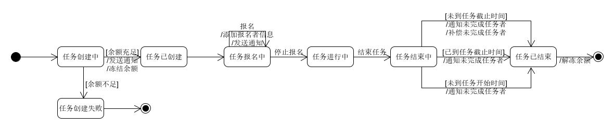
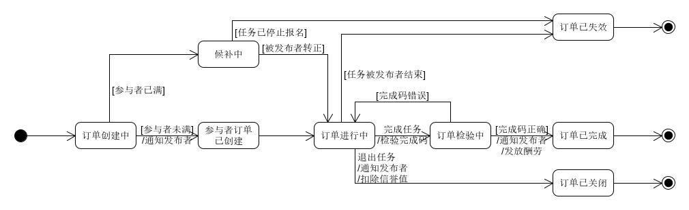

# 状态模型
在本项目中，存在着“任务状态机”和“订单状态机”，两种状态机分别对应“发布者视角”和“报名者视角”。我们可以将众包平台的发布任务与接受任务与电商平台类比——发布者比作卖家，报名者比作买家。进而，“任务状态机”可视作“商品的状态机”，“订单状态”可视作“购物订单的状态机”。
## 任务状态机
任务状态机是由任务发布者控制的，由3种主要状态和其他次要状态组成，主要状态有：
 - 任务报名中
 - 任务进行中
 - 任务已结束
 
完整的状态模型如下：

## 订单状态机
订单状态机是由报名者控制的，并会受到任务状态机影响。由5种主要状态和其他次要状态组成，主要状态有：
- 订单进行中
- 候补中
- 订单已完成
- 订单已关闭
- 订单已失效

完整的状态模型如下：

