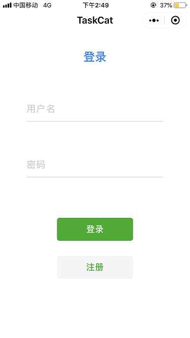
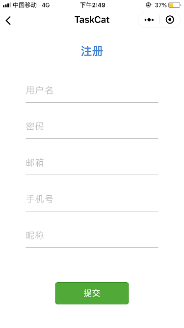
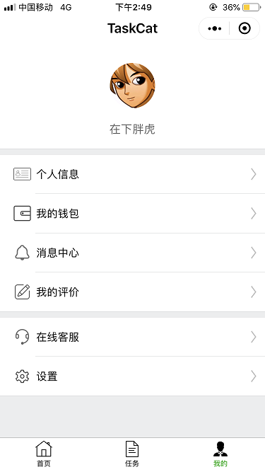
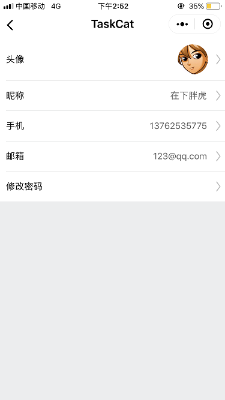
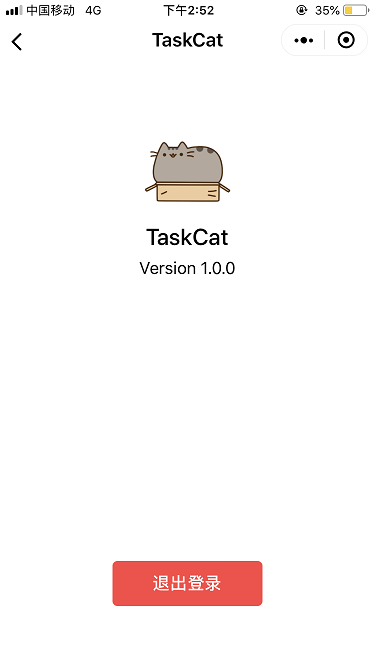
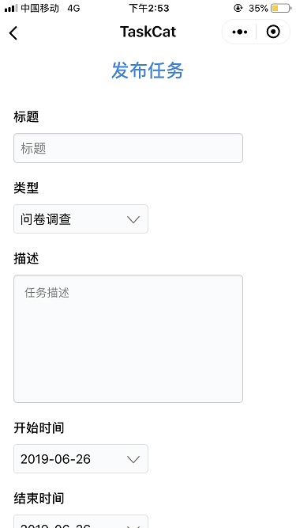
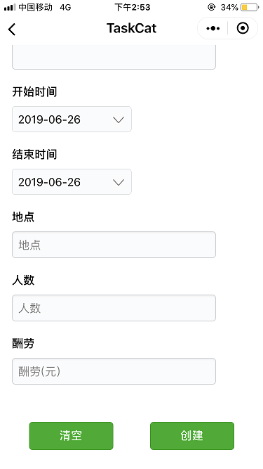

# UI设计

## 设计思路
本项目UI设计的总体原则为：清新。为实现该目标，在设计风格上我们使用了当前业界较为认可的“扁平化”设计；在内容排布上，我们尽可能只呈现关键、重要的信息，将更为详细的信息折叠进二级页面内；在交互上，我们将简化操作的逻辑，减少用户完成Happy Path的操作次数。

## 配色方案
本程序是基于微信小程序开发的，为了给用户带来愉悦、舒适、一致的视觉体验，本项目的配色方案将与微信保持高度一致。

### 背景色

### 字体

### 按钮

## 页面导航

## 登录页面

## 注册页面

## 首页

## 任务页面

## 用户页面

## 用户信息

## 用户钱包

## 消息列表

## 登出

## 任务发布

## 任务搜索

## 任务详情

## 任务评价

## 候选列表

## 地图

