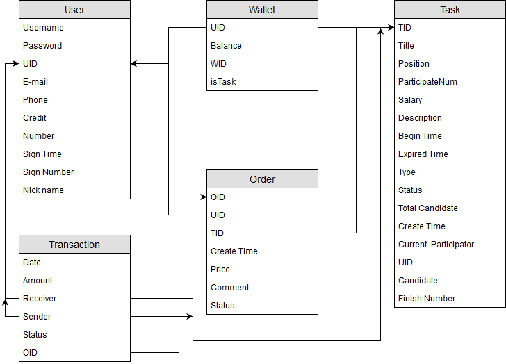

# Database design

数据库设计时主要的目的就是快速搭建和容易扩容和增添属性等,以便以后进行开发时无需过多调整数据库语句  
加上后端采用koa,一个基于express的nodejs服务框架来进行搭建,故采用mongodb是一个比较好也比较符合我们需求的数据库--其轻量,反应速度够快,数据无需处理就能存入表中,是一个很好的面对这种用例不能十分明确的场景,特别是在后期调整某些属性时也能做到无缝适配,免去了更新关系型数据库的痛苦

其最终实现的结构如下图


## 用户及权限数据逻辑设计
用户理论上永远只能触碰到自己或者别人的公开信息,而对其它信息就有着严格的控制流程
而对于敏感信息的控制有着一套流程,特别是钱财交易时存在一个授权问题,这时就需要有对操作人身份的验证.
这时后端对操作人身份验证后就有才进行一次授权的交易行动,并且这次交易的各种信息都被存入交易信息的数据库,以用来后期进行检查或者出现纠纷时作为证据.
用户对任务的权限也经过审核,这样就不会出现修改他人信息的情况出现

## 任务和钱包的数据逻辑关系
如任务开启后就要预付所有佣金到平台上,就是每个Task都有一个钱包,这个钱包就是所有用户都不能修改的,只能由系统在订单结算的时候进行,也能在任务取消时进行退还结算


而对于数据结构的设计,采取了迭代的方法,下面是第一版设计的方案,现在看来有很多遗漏的东西

## User
```JSON
{
    "date":"time",
    "uid":123,
    "username":"",
    "password":"",
    "email":"",
    "phone":"",
    "address":["a","b"],
    "paymentpwd":"",
    "balance":3,
    "credit":10,
    "selftag":["nipple","dick"],
    "systemtag":["asshole"]
}
```

## Task
```JSON
{
    "createDate":"date",
    "expireDate":"date",
    "tid":123,
    "title":"",
    "detail":"",
    "tag":["sucker","jerk"],
    "publisher":"uid",
    "cost":3,
    "receiver":3
}
```

## Order
```JSON
{
    "createDate":"date",
    "oid":123,
    "employer":"uid",
    "employee":"uid",
    "status":1,
    "amount":3
}
```
