# 用例设计
## 注册登录用例
### 顺序图

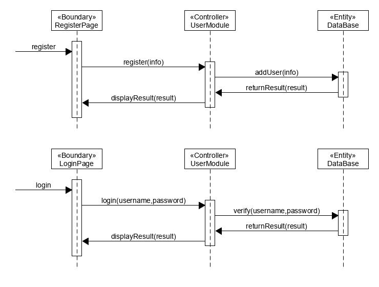
### 类图
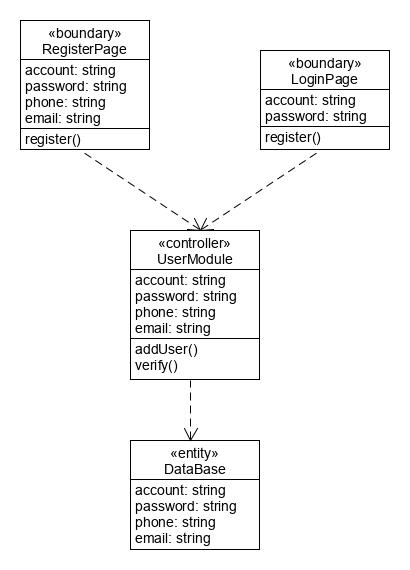

## 发布任务用例
### 顺序图

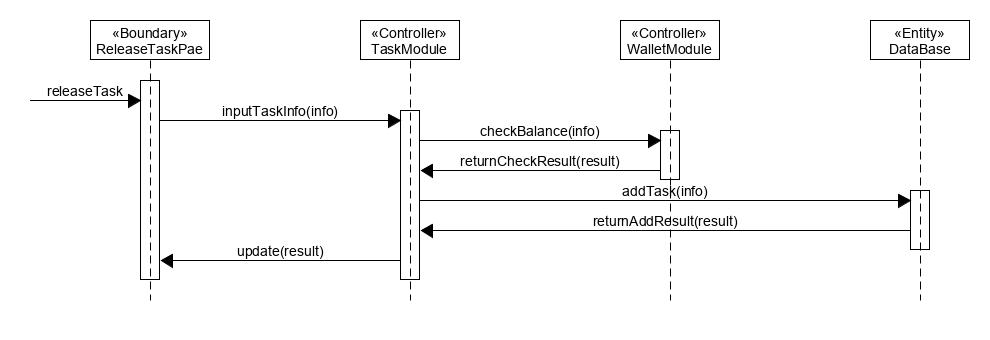

### 类图

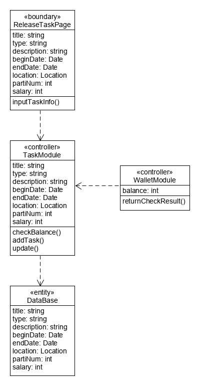

## 查找任务用例
### 顺序图

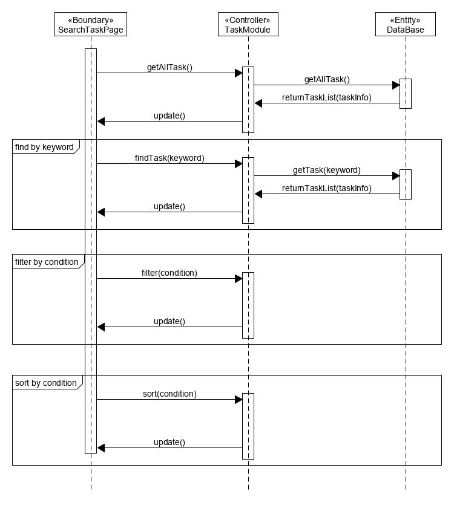

### 类图

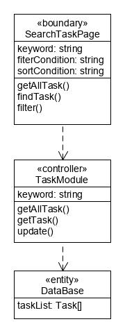

## 报名用例
### 顺序图

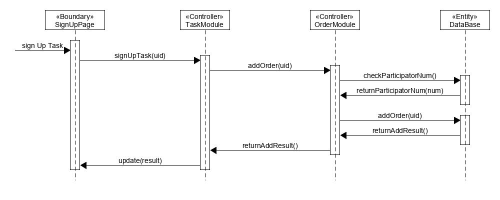

### 类图

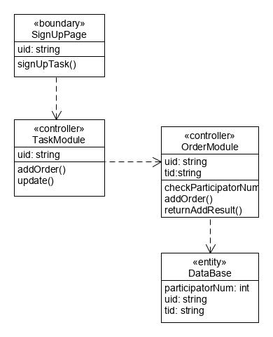

## 查看任务用例
### 顺序图

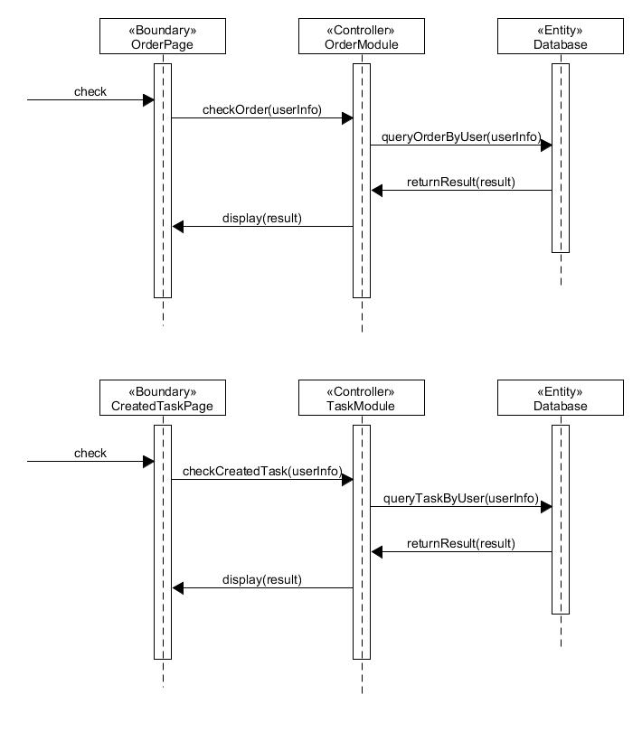

### 类图

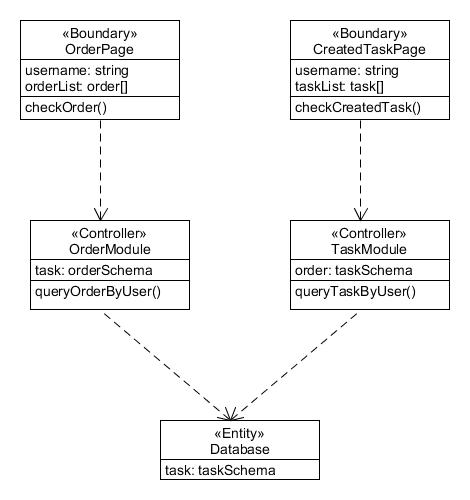

## 查看消息用例
### 顺序图

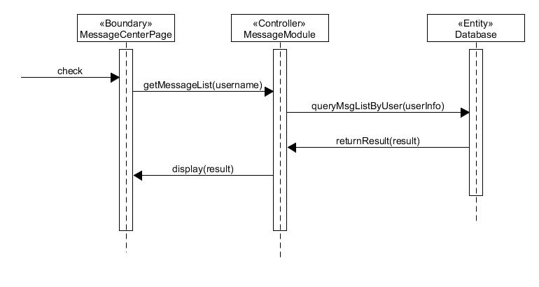

### 类图

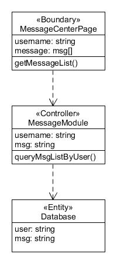

## 充值提现用例
### 顺序图

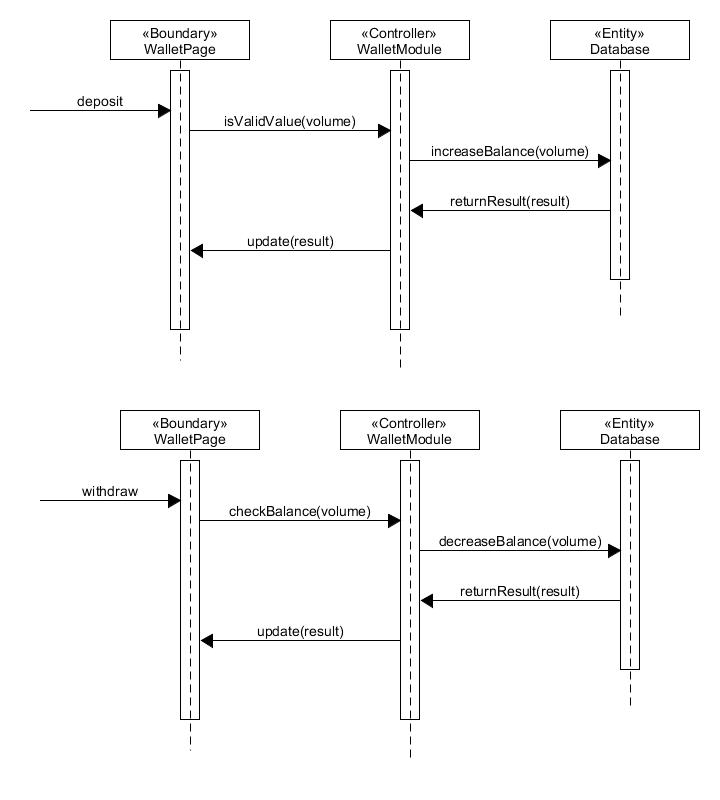

### 类图

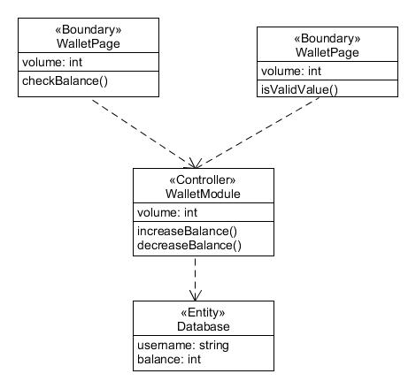

## 修改信息用例
### 顺序图

### 类图

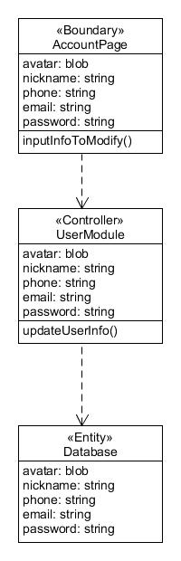

