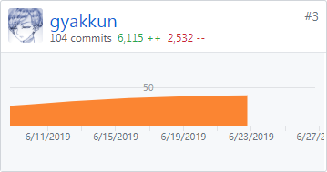

## 个人总结

在本次项目中, 个人主要担任前端开发, 使用的是微信提供的小程序框架。

课余时间写JS比较多, 但实际参与的工程很少, 前端工作可以说是一个新的挑战。在最高支持到ES6的小程序运行环境中还出现了一些奇怪的小问题, 比如带分组正则表达式无法正确识别, 不支持关键字async/await等。

在具体的开发中, 个人的主要工作是任务发布和搜索和推荐。这些列表页的筛选、排序等的交互涉及到不少原生JS知识, 也因此用上了很多以前自己写的东西(笑)。

由于API设计的关系, 工作中遇到的最困难的一个问题是如何异步地获取任务发布者的用户名和头像, 因为任务信息中只存了发布者uid。应用中共出现四次任务列表, 任务列表信息在请求后由一个页面内的数组维护, 而用户名需要在此后异步请求得到, 是一次对数组forEach的操作。由于始终没搞懂小程序环境中forEach是同步还是异步的, 在引入了Facebook的runtime generator引入async/await后仍无法异步更新这个全局数组, 一度考虑用worker。最后发现队友yz@stwie2k在其他列表里用了一个相当富有想象力的写法, 遂解决该问题(见[Issue43](https://github.com/2019swsad/AngryCat/issues/43))。

本次项目实践经历了不少波折, 多亏有负责任的两位经理以及后端强大的支撑, 项目才得以如期高质量完成。感谢队友们对我的鞭策。

## PSP2.1 统计表

| PSP2.1                   | Personal Software Process Stages | Time (%) |
| ------------------------ | -------------------------------- | -------- |
| **Planing**              | **计划**                         | **1**    |
| Estimate                 | 估计这个任务需要多少时间         | 1        |
| **Development**          | **开发**                         | **94**   |
| Analysis                 | 需求分析                         | 10       |
| Design Spec              | 生成设计文档                     | 3        |
| Design Review            | 设计复审                         | 2        |
| Coding Standard          | 生成代码规范                     | 1        |
| Design                   | 具体设计                         | 5        |
| Coding                   | 具体编码                         | 60       |
| Code Review              | 代码复审                         | 10       |
| Test                     | 测试                             | 3        |
| **Reporting**            | **报告**                         | **5**    |
| Test Report              | 测试报告                         | 0        |
| Size Measurement         | 计算工作量                       | 1        |
| Process Improvement Plan | 事后总结及改进计划               | 4        |

## 贡献

#### 前端

#### 后端

微小的工作:

Docker: https://cloud.docker.com/repository/docker/gyakkun/2019swsad-server

## 有价值的工作

在最开始解决了一下小程序存cookie的问题, 使后端不需要增加额外的逻辑去适配微信用户。从任务列表页到详情页的参数传递, 在开发中更换了兼容性更好的办法。头像部分的联调。最后给后端做了个Docker部署。

## 一些博客

https://stevewuzhi.github.io/2019/06/28/simple-node-docker/

https://stevewuzhi.github.io/2019/06/28/simple-nginx-reverse-proxy/
