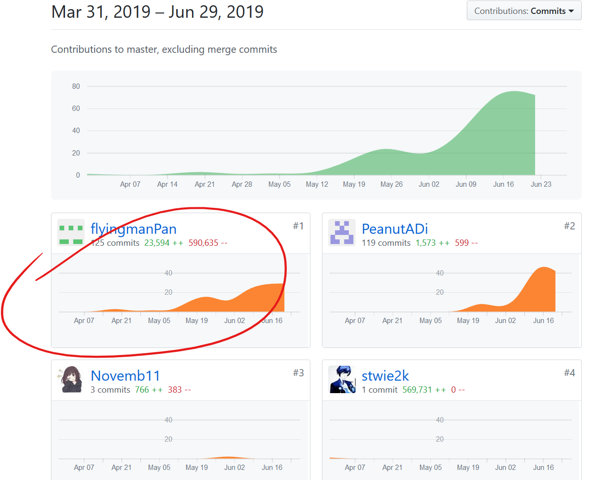
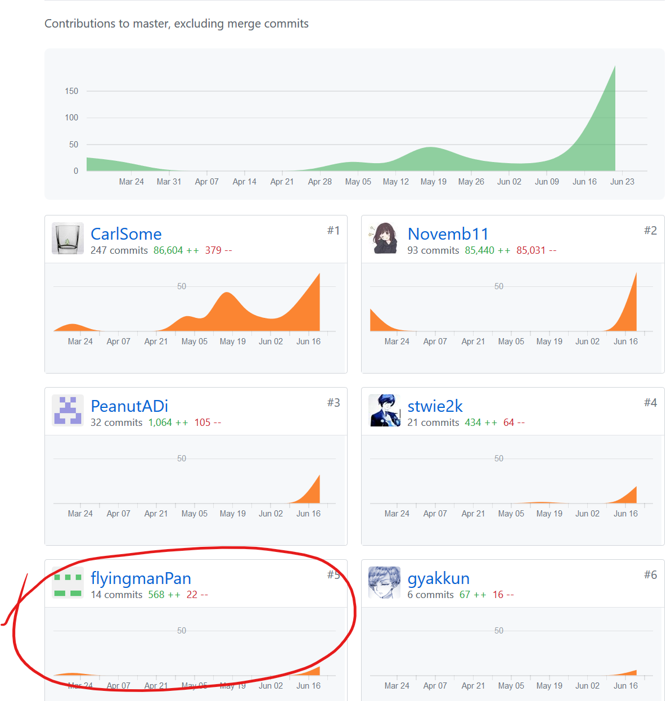

# 个人总结
这次项目中我担任的是后端的总设计,设计了较为多的模块,所以在这次项目中我承担的压力和责任都是十分的大,毕竟后端的开发直接影响前端的很多开发和测试.好在后端的开发比较提前就开始了,而且没有出现很多大问题,在中后期开发时经常讨论和交流也让我对团队合作和交流得到的更深的体会.  
当然,交流所带来的结果肯定是协同开发的进度更加快,更少问题,以及技术对前后端,对每一个人更加透明.    
当时选型时采用的技术栈对于我来说并不陌生,但是框架是全新的,故开发时的也有对新组件上手的痛苦时期.过了这个时期后就完全没有开发的技术压力了.

# PSP  2.1 统计表
| PSP2.1 | Personal Software Process Stages | Time (%) |
| ---- | ---- | ---- |
| __Planing__ | __计划__ | __15__ |
| Estimate | 预估任务时间 | 5 |
| __Development__ | __开发__ | __80__ |
| Analysis | 需求分析 | 10 |
| Design Spec | 生成设计文档 | 15 |
| Design Review | 设计复审 | 2 |
| Coding Standard | 生成代码规范 | 3 |
| Design | 具体设计 | 10 |
| Coding | 具体编码 | 30 |
| Code Review | 代码复审 | 5 |
| Test | 测试 | 5 |
| __Reporting__ | __报告__ | __5__ |
| Test Report | 测试报告 | 2 |
| Size Measurement | 计算工作量 | 1 |
| Process Improvement Plan | 事后总结及改进计划 | 2 |

# Git Stat

此为后端贡献记录

此为Dashboard共享记录

# 最得意的工作
- 完成了一套较为可靠的交易-钱包逻辑,能稳妥地实现了交易管理和溯源的功能
- 完成了一个较为模块化的架构,能使其他开发者能较快上手
- 使用了较为可靠的测试工具进行测试

# 致谢
先致谢我的这一个团队,能在遇到重大分歧时能坐下来慢慢谈而不是打起来,最后能完成一个完成度还不错的系统.然后感谢我的舍友能忍住睡觉时打代码不起来打死我.