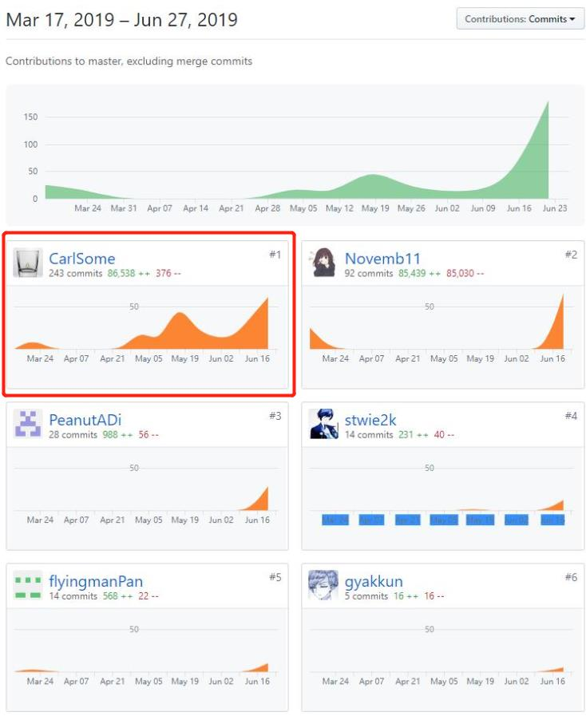
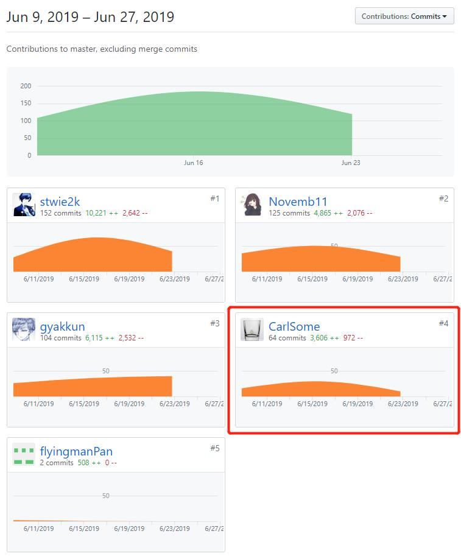

# 个人总结
## 个人简短小结
在本次课程项目开发过程中，我主要负责文档撰写、原型制作、前端开发、测试工作，其中在前端主要负责二级页面开发和UI设计。

以下是我在本项目中完成的主要工作：

### 文档撰写
- 构思并完成项目的About、Team Profile、Vision、Product Backlog、Requirement Specification、UI design和Usecase design等主要文档

### 原型制作
- 在已完成的文档的基础上，用Axure制作了项目的原型

### 前端开发
- 个人信息相关页面的编码
- UI设计

### 测试工作
- 完成集成测试的debug工作

## PSP 2.1统计表
| PSP2.1 | Personal Software Process Stages | Time (%) |
| ---- | ---- | ---- |
| __Planing__ | __计划__ | __5__ |
| Estimate | 预估任务时间 | 5 |
| __Development__ | __开发__ | __90__ |
| Analysis | 需求分析 | 10 |
| Design Spec | 生成设计文档 | 30 |
| Design Review | 设计复审 | 5 |
| Coding Standard | 生成代码规范 | 0 |
| Design | 具体设计 | 10 |
| Coding | 具体编码 | 20 |
| Code Review | 代码复审 | 5 |
| Test | 测试 | 10 |
| __Reporting__ | __报告__ | __5__ |
| Test Report | 测试报告 | 1 |
| Size Measurement | 计算工作量 | 1 |
| Process Improvement Plan | 事后总结及改进计划 | 3 |

## 最得意/或有价值/或有苦劳的工作清单
- **文档撰写**：文档撰写是一件苦活，因为在撰写前我需要深入思考这个项目的业务逻辑。但是，完整的文档是编码工作顺利开展的基础。此外，因为有对项目的深入思考，我对整个项目了然于胸。因此组员在编码过程中遇到困难的时候，我都可以帮大家梳理思路。
- **原型制作**：原型制作是一件有价值的事情，因为它可以帮助大家更直观地理解项目的业务逻辑和功能点。此外，在前端开发的过程中，大家也可以直接参考原型开发，提高开发的焦虑、降低沟通成本。
- **测试**：测试工作非常痛苦，因为整个团队只有我最熟悉业务逻辑，因此我花了非常多的时间在软件测试上。从Issue来看，项目的大部分BUG都是我发现的，推动了软件质量的提高。

## Git统计报告
### Dashboard

### 前端

## 个人博客清单
- [系分项目日记](https://blog.csdn.net/qq_19653127/article/details/94054444)
- [Axure使用不完全指北——从安装到部署](https://blog.csdn.net/qq_19653127/article/details/94174649)
- 域名+SSL历程

## 特别鸣谢
- 项目经理：虽然我也兼任项目经理，但是在项目管理上我的手腕比较软，如果没有项目经理的铁腕督促，我们的项目恐怕是很难完成；
- 架构师：我们小组非常缺乏懂后端开发的人，但是感谢架构师能挑起大梁、主导了后端的开发，且完成质量非常高，也很有技术含量，为项目增色不少；
- 以及其他所有成员，尽管开发的过程很曲折，中间也有过不愉快。但是大家最终齐心协力完成任务的过程，非常令人振奋。
