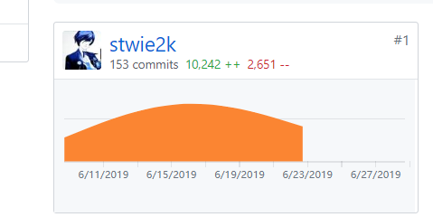
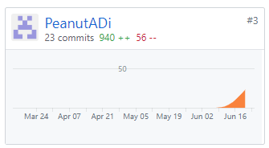

# 自我总结

在本项目中我担任的工作是前端工程师。作为技术栈偏前端的成员，这次工作中我所承担的责任和压力还是比较大的，也给自己造成了比较大的挑战。好在小组成员之间的交流非常频繁，有不懂的地方都可以互相讨论，帮助自己极大的提升了项目进度的开发速度。

本次项目主要使用的是微信小程序的技术栈。微信小程序作为近几年来开始风靡的一种移动应用技术，理所应用成为了我们的首选。但是因为之前没有接触过微信小程序的技术栈，虽然有一些前端的基础，但是对于这种组件化的开发方式还是有些陌生，因此在上手时还是、遇到了一些困难。在参考了一定的教程和融入自身理解之后，还是得以顺利完成任务，对自己解决问题的能力有了很大的提升。

## PSP 2.1 统计表

| PSP2.1                   | Personal Software Process Stages | Time (%) |
| ------------------------ | -------------------------------- | -------- |
| __Planing__              | __计划__                         | __3__    |
| Estimate                 | 估计这个任务需要多少时间         | 1        |
| __Development__          | __开发__                         | __92__   |
| Analysis                 | 需求分析                         | 10       |
| Design Spec              | 生成设计文档                     | 4        |
| Design Review            | 设计复审                         | 0        |
| Coding Standard          | 生成代码规范                     | 0        |
| Design                   | 具体设计                         | 10       |
| Coding                   | 具体编码                         | 60       |
| Code Review              | 代码复审                         | 10       |
| Test                     | 测试                             | 3        |
| __Reporting__            | __报告__                         | __5__    |
| Test Report              | 测试报告                         | 0        |
| Size Measurement         | 计算工作量                       | 1        |
| Process Improvement Plan | 事后总结及改进计划               | 4        |

## Git统计报告

Client 部分：

Dashboard部分：

## 最得意的工作清单

- 独立学习小程序的开发，学习语言特性，并完成具体架构设计
- 与后端进行接口联调，通过接口测试后端的api是否正确，并且与后端进行交流，实时修改逻辑，同时也可以对整个软件的架构都有所了解

## 个人博客清单

## 致谢

特别感谢全组成员持续的努力，一个好的软件离不开所有人的力量，即使是少了一个人最终的效果可能都会大打折扣，希望
