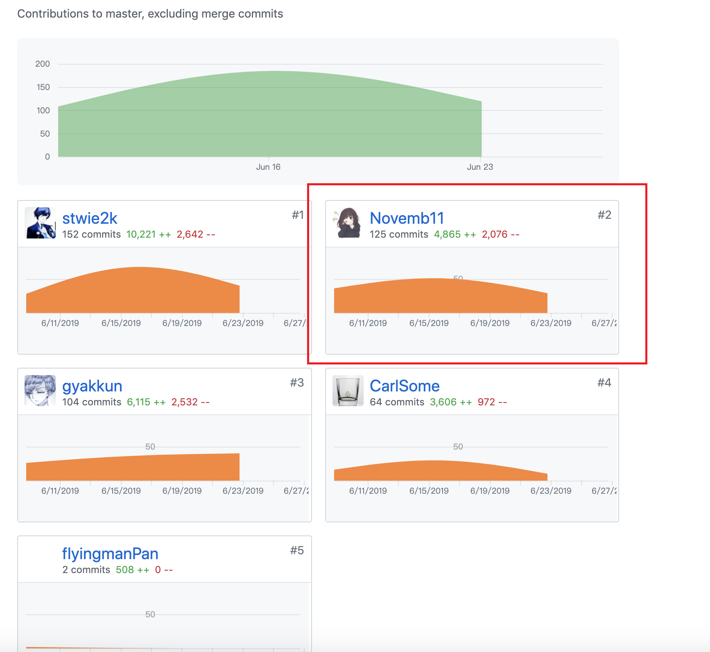
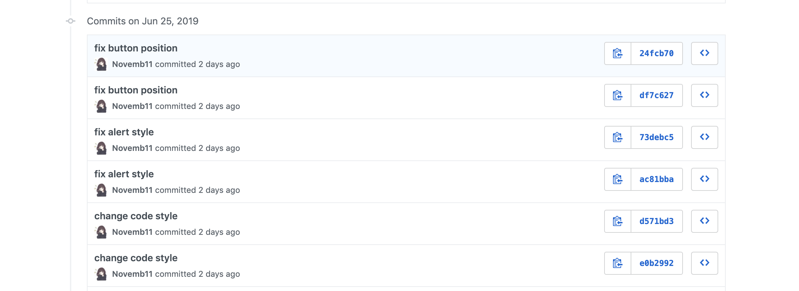
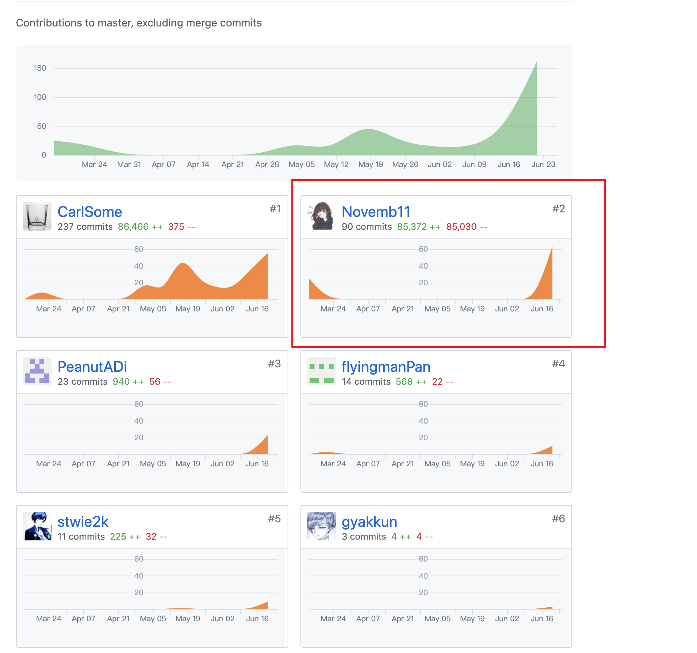

## 个人总结

在本次课程项目开发过程中，我主要负责前端开发、软件测试和项目管理，其中在前端主要负责 UI 设计

以下是我在本项目中的大概职责：

#### 管理

* 召集成员，组织并监督成员工作
* 协助前后端进行沟通，辅助任务对接
* 进度控制，不断调节团队工作进度
* 敲定重要工作决策

#### 分析

* 参与项目的需求分析
* 参与项目的功能设计

#### 开发

* UI 设计
* 部分模块的搭建
* 软件测试和帮忙 debug

## PSP 2.1统计表

| PSP2.1 | Personal Software Process Stages | Time (%) |
| ---- | ---- | ---- |
| __Planing__ | __计划__ | __5__ |
| Estimate | 估计这个任务需要多少时间 | 5 |
| __Development__ | __开发__ | __90__ |
| Analysis | 需求分析 | 15 |
| Design Spec | 生成设计文档 | 0 |
| Design Review | 设计复审 | 3 |
| Coding Standard | 生成代码规范 | 0 |
| Design | 具体设计 | 20 |
| Coding | 具体编码 | 50 |
| Code Review | 代码复审 | 2 |
| Test | 测试 | 10 |
| __Reporting__ | __报告__ | __5__ |
| Test Report | 测试报告 | 0 |
| Size Measurement | 计算工作量 | 2 |
| Process Improvement Plan | 事后总结及改进计划 | 3 |

## 最得意的工作清单

最得意：分析需求和设计UI。我认为我们项目的 UI 是一个大亮点，我们采用了类似微信的风格，页面简约得体，使用起来体验很好。

## Git统计报告

**前端**

**Dashboard**

## 个人博客清单

## 致谢

在此需要感谢本小组的团队成员，如果没有大家的相互配合，本项目难以圆满完成。无论是前端、后端还是文书工作，大家都发挥了高超的水平，为项目增加亮点。
正是大家的努力让如今的项目拥有那么多复杂和精彩的功能。
