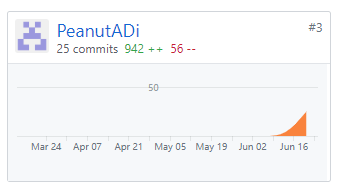

# 自我总结

在本项目中我担任的工作是市场调研以及后端工程师。这是我第一次以一个相对严谨的工作小组和工作流程完成一个项目。我在本项目参与的直接开发时间持续六周以上，于3个月前发布问卷并开始市场调研，我们小组举行会议、设计时间频繁并且很早就开始。这是一个时长较长、规范虽然仍不合格但已在慢慢完善的开发项目，我在这个过程中学到了很多东西。

## PSP 2.1 统计表

| PSP2.1                   | Personal Software Process Stages | Time (%) |
| ------------------------ | -------------------------------- | -------- |
| __Planing__              | __计划__                         | __1__    |
| Estimate                 | 估计这个任务需要多少时间         | 1        |
| __Development__          | __开发__                         | __94__   |
| Analysis                 | 需求分析                         | 10       |
| Design Spec              | 生成设计文档                     | 4        |
| Design Review            | 设计复审                         | 0        |
| Coding Standard          | 生成代码规范                     | 0        |
| Design                   | 具体设计                         | 10       |
| Coding                   | 具体编码                         | 60       |
| Code Review              | 代码复审                         | 10       |
| Test                     | 测试                             | 3        |
| __Reporting__            | __报告__                         | __5__    |
| Test Report              | 测试报告                         | 0        |
| Size Measurement         | 计算工作量                       | 1        |
| Process Improvement Plan | 事后总结及改进计划               | 4        |

## Git统计报告

Server 部分：

Dashboard部分：

## 最得意的工作清单

- 后端实现：本次项目是我第一次完整的参与项目后端的构建，在大佬的帮助下我们的server实现的很棒。耦合度很低，鲁棒性强，基本的业务逻辑后端几乎全部实现。虽然我花了大量的时间Debug，还是一次很好的code体验！
- 市场调研 & 竞品报告：我花费了大量的时间去思考问卷的设计，并费心在市场上寻找了大量的竞品APP进行比对，最终选择了几个最具有借鉴意义的竞品。

## 个人博客清单

[“挣闲钱”的市场调研过程](https://peanutadi.github.io/2019/06/25/swsad-market/)

[koa学习记录](https://peanutadi.github.io/2019/06/26/swsad-nodejs/)

[MongoDB学习记录](https://peanutadi.github.io/2019/06/20/swsad-mongodb/)

## 致谢

特别感谢 盘学之@flyingmanPan 带躺。本小组所有成员工作积极，有过争执但最终呈现的产品质量非常高，大家都辛苦了。
